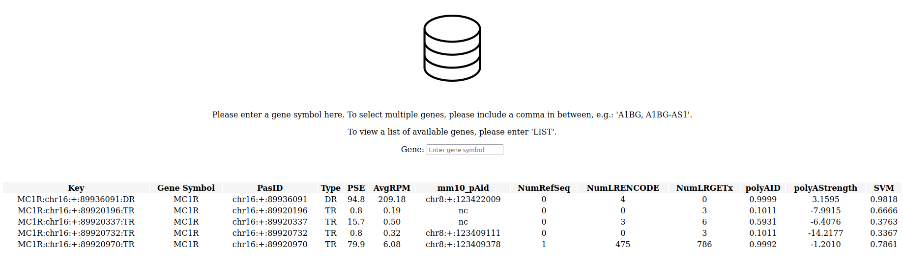

# Database Management for Polyadenylation Sites

 

 

## Table of Contents

I. Introduction

II. Schema

III. Column Description

IV. Database Interaction via Web

V. Technologies

VI. Abbreviation

VII. Acknowledgements

VIII. References

 

## I. Introduction

PolyADB4-LR database (v4.01-LR) stores information for an extended set of polyadenylation (polyA) sites found in human genome (hg38) using 3’READS+ deep sequencing.  The polyA sites are additionally supported by long read sequencing and data generated from machine learning, and are annotated via NCBI database and by IsoQuant-assigned long reads of ENCODE and GTEx.  This database contains 658,880 entries, 638,089 unique polyA sites, and 33,614 unique genes, and is based on ~2.3 billion 3’READS+ sequencing reads and ~600 million long reads.

 

## II. Schema

| Column | Data Type | Constraint |
| ---- | ---- | ---- |
|Key |VARCHAR(100) |PRIMARY KEY NOT NULL |
|Gene Symbol |VARCHAR(40) |NOT NULL |
|PasID |VARCHAR(40) |NOT NULL |
|Type |VARCHAR(2) |NOT NULL |
|PSE |NUMERIC(4,1) |CHECK(PSE >= 0) |
|AvgRPM |NUMERIC(10,2) |CHECK(AvgRPM >=0) |
|mm10_pAid |VARCHAR(40) | |
|NumRefSeq |NUMERIC(10) |CHECK(NumRefSeq >=0) |
|NumLENCODE |NUMERIC(10) |CHECK(NumLRENCODE >=0) |
|NumLRGETx |NUMERIC(10) |CHECK(polyAID >=0) |
|polyAID |NUMERIC(10,4) | |
|SVM |NUMERIC(5,4) |CHECK(SVM >=0) |

 

## III. Column Description

| Column | Description |
| ---- | ---- |
|Key |Unique identification for PAS (gene symbol : chromosome : strand : position : type). |
|Gene Symbol |Abbreviation for gene name. |
|PasID |PAS identification (chromosome : strand : position). |
|Type |Long-read-TES-supported polyA site category: TR: PAS found in terminal regions, in which the regions are identified as aggregated overlapping 3’-most exon of isoform of each gene by RefSeq TES annotation; UR: upstream regions of TR;  DR: downstream regions of TR. |
|PSE |Percentage of samples which PASs were expressed. |
|AvgRPM |Mean RPM of PAS. |
|mm10_pAid |Conserved sites in mouse genome (mm10). Non-conserved sites are labeled as "nc". |
|NumRefSeq |Number of the PAS reads annotated by RefSeq TESs. |
|NumLENCODE |Number of long-read TESs (from the ENCODE4 PacBio IsoSeq dataset) that were matched to the PAS location. |
|NumLRGETx |Number of long-read TESs (from the GTEx V9 ONT cDNA dataset) that were matched to the PAS location. |
|polyAID |Classification probability for putative PAS within a sequence expected to occur (https://github.com/zhejilab/PolyaModelsHuman). |
|polyAStregth |Score for the usage level of PAS (https://github.com/zhejilab/PolyaModelsHuman). |
|SVM |Predicted PAS probability by support vector machine (polya_svm v1.1: https://exon.apps.wistar.org/polya_svm/). |

 

## IV. Database Interaction via Web

Figure 1.  Viewing a list of available genes in the database.  User database interaction via web is supported by Flask.

 

Figure 2.  Querying for a specific gene.

 

## V. Technologies

Database, PostgreSQL, SQL, pgAdmin4, Jupyter Notebook, Python, Flask, VS Code, Git, Linux, Machine Learning, Deep Learning

 

## VI. Abbreviation

PAS: polyA site  

TES: Transcription end site

 

## VII. Acknowledgements

I would like to express gratitude to Dr. Bin Tian’s lab for data availability and contribution.

 

## VII. Reference

Cheng Y, Miura RM, and Tian B.  2006.  Prediction of mRNA polyadenylation sites by support vector machine.  Bioinformatics, 22(19):2320-5.  doi: 10.1093/bioinformatics/btl394.

Glinos DA, Garborcauskas G, Hoffman P, Ehsan N, Jiang L, Gokden A, Dai X, Aguet F, Brown KL, Garimella K, Bowers T, Costello M, Ardlie K, Jian R, Tucker NR, Ellinor PT, Harrington ED, Tang H, Snyder M, Juul S, Mohammadi P, MacArthur DG, Lappalainen T, and Cummings BB.  2022.  Transcriptome variation in human tissues revealed by long-read sequencing.  Nature, 608(7922):353-359.  doi: 10.1038/s41586-022-05035-y.

Hoque M, Ji Z, Zheng D, Lou W, Li W, You B, Park JY, Yehia G, and Tian B.  2013.  Analysis of alternative cleavage and polyadenylation by 3' region extraction and deep sequencing.  Nat Methods, 10(2):133-9.  doi: 10.1038/nmeth.2288.

Lee JY, Yeh I, Park JY, and Tian B.  2007.  PolyA_DB 2: mRNA polyadenylation sites in vertebrate genes.  Nucleic Acids Res, 35:D165-8.  doi: 10.1093/nar/gkl870.

Reese F, Williams B, Balderrama-Gutierrez G, Wyman D, Çelik MH, Rebboah E, Rezaie N, Trout D, Razavi-Mohseni M, Jiang Y, Borsari B, Morabito S, Liang HY, McGill CJ, Rahmanian S, Sakr J, Jiang S, Zeng W, Carvalho K, Weimer AK, Dionne LA, McShane A, Bedi K, Elhajjajy SI, Upchurch S, Jou J, Youngworth I, Gabdank I, Sud P, Jolanki O, Strattan JS, Kagda MS, Snyder MP, Hitz BC, Moore JE, Weng Z, Bennett D, Reinholdt L, Ljungman M, Beer MA, Gerstein MB, Pachter L, Guigó R, Wold BJ, and Mortazavi A.  2023.  The ENCODE4 long-read RNA-seq collection reveals distinct classes of transcript structure diversity.  bioRxiv.  doi: 10.1101/2023.05.15.540865.

Stroup EK, and Ji Z. 2023. Deep learning of human polyadenylation sites at nucleotide resolution reveals molecular determinants of site usage and relevance in disease. Nature Commun, 14(1):7378:1-17.  doi: 10.1038/s41467-023-43266-3.

Wang R, Nambiar R, Zheng D, and Tian B.  2017.  PolyA_DB 3 catalogs cleavage and polyadenylation sites identified by deep sequencing in multiple genomes.  Nucleic Acids Res, 46(D1):D315-D319.  doi: 10.1093/nar/gkx1000.

Zhang H, Hu J, Recce M, and Tian B.  2005.  PolyA_DB: a database for mammalian mRNA polyadenylation.  Nucleic Acids Res, 33:D116-20.  doi: 10.1093/nar/gki055.

Zheng D, Liu X, and Tian B.  2016.  3'READS+, a sensitive and accurate method for 3' end sequencing of polyadenylated RNA.  RNA, 22(10):1631-9.  doi: 10.1261/rna.057075.116.

